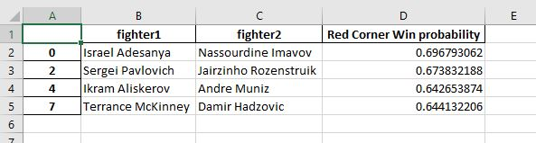
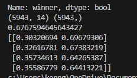
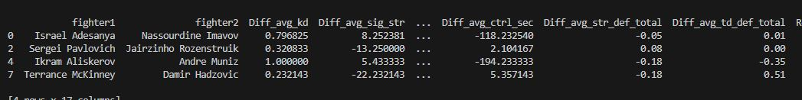
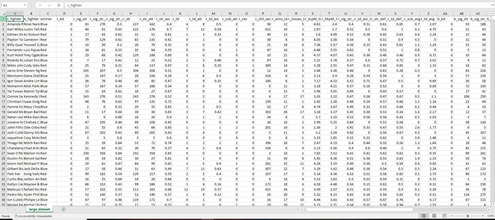

# UFC MACHINE LEARNING OUTCOME PREDICTOR

## DESCRIPTION
Python built machine-learning algorithm using Logistic Regression and Cross-Validation with the help of Pandas and the scikit-learn library. Model built as of 1/26/25.  
Algorithm is built to predict the binary outcome of a MMA fight (win/loss) with the help of data from ufcstats.com (Model is 67.68% accurate at predicting fights).
- Logistic Regression is used due to the outcome being binary (A fighter can either only win or lose)
- 5 K-Folds are used (model is trained on 80% of data, last 20% of data is used for testing) in cross-validation.

## Features
- knockdowns
- significant strikes landed
- significant strikes attempted
- significant strike accuracy
- strikes landed
- strikes attempted
- strike accuracy
- takedowns landed
- takedowns attempted
- takedown accuracy
- submission attempts
- ground control time in seconds
- strike defense percentage
- takedown defense percentage

## Pictures

## Flaws of algorithm
- Fights outside of UFC do not have data, making fights involving debuting fighters impossible to predict
- Does not account for athlete regression due to age
- Does not account for injuries from previous fight
- Does not account for athletes returning after a long lay off

## Resources
- Logistic Regression: https://en.wikipedia.org/wiki/Logistic_regression
- Cross Validation: https://en.wikipedia.org/wiki/Cross-validation_(statistics)
- Cross Validation intro video: https://www.youtube.com/watch?v=fSytzGwwBVw
- UFC Dataset and Large scraper for raw data in csv format: https://www.kaggle.com/datasets/maksbasher/ufc-complete-dataset-all-events-1996-2024/data
- NFL Game Prediction Project for reference: https://colab.research.google.com/drive/1_myoj4ecB1GuRVRBz-vTrQ-SXg7Ld2qm?usp=sharing
